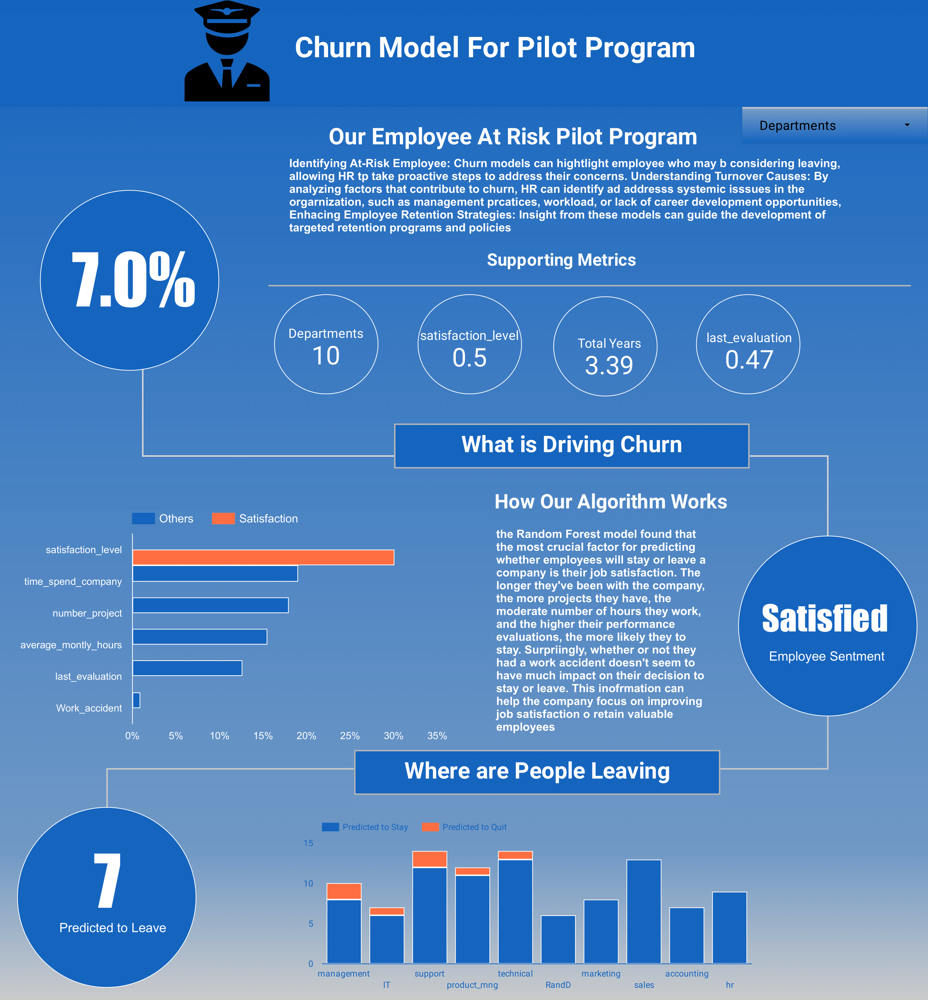

# Churn Model for Pilot Program

## Overview
This repository hosts the development of an end-to-end employee retention program designed to identify and address the factors leading to employee churn. Leveraging Google Cloud's BigQuery and advanced data science techniques, this project aims to predict which new employees might leave the company prematurely and devise strategies to improve retention.

## Objective
The primary objective of this project is to implement a Google Cloud-based solution to proactively identify employees at risk of leaving, thereby allowing for timely interventions.

## Problem Statement
Despite ongoing efforts, our organization faces challenges in maintaining employee retention rates. The goal of this project is to assist the human resources department by using data-driven insights to identify employees who are likely to churn, especially among new hires in our pilot program.

## Solution Approach
- **Pilot Selection**: Focus on new employees under the pilot program.
- **Data Modeling**: Utilize automated machine learning tools to train models on historical data.
- **Prediction**: Predict the likelihood of new employees leaving the company.

## Project Workflow
1. **Database Construction**: Set up a structured database in Google Cloud's BigQuery.
2. **Data Connection**: Utilize Python scripts in Google Colab to interact with the BigQuery database.
3. **Churn Prediction Model**: Develop a churn prediction model using PyCaret, an autoML library.
4. **Data Exportation**: Export the predictive results back to BigQuery for further analysis.
5. **Dashboard Creation**: Develop an interactive dashboard in Looker Studio to visualize the results and report on findings.

## Technologies Used
- **Google BigQuery**: For database management and querying.
- **Google Colab**: For executing Python notebooks and scripts.
- **PyCaret**: For building and deploying the machine learning model.
- **Looker Studio**: For creating interactive dashboards to display insights.

## Deliverables
The primary deliverable for this project is an interactive dashboard that provides a comprehensive view of employee churn risks among new hires. This dashboard will help in making informed decisions to enhance employee retention strategies.

